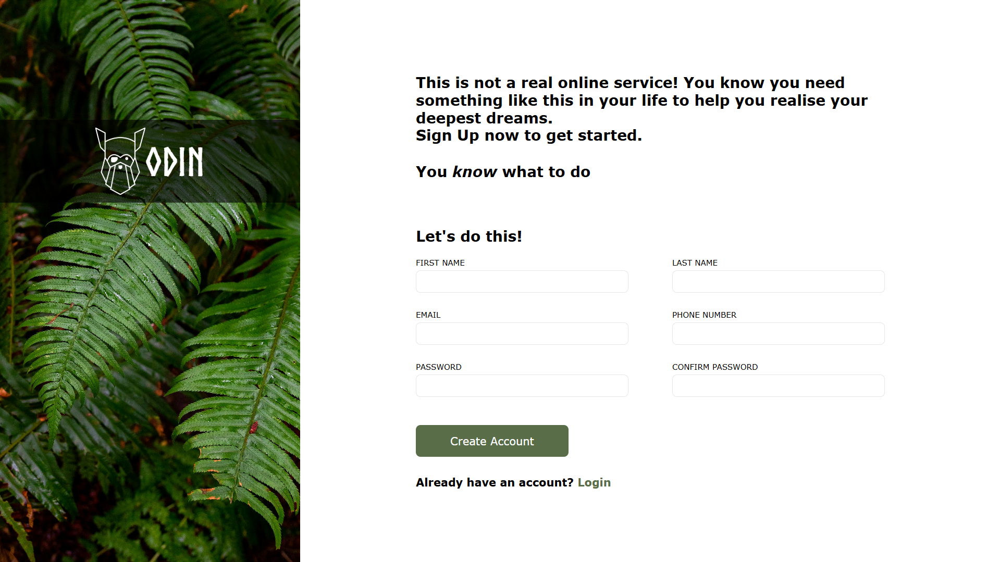

# Sign Up Form

Sign-up forms built as part of [The Odin Project](https://www.theodinproject.com/) curriculum with vanilla HTML, CSS, and JavaScript.

---

## Tech Used

- HTML
- CSS
- JavaScript (vanilla)

---

## Features

- Sign up form with first name, last name, email, phone, password, and confirm password fields
- Client-side validation with descriptive error messages
- Password strength indicator
- Errors show on blur, clear on input

---

## Acknowledgements

The Odin Project

---

## Author
Dhee-codes